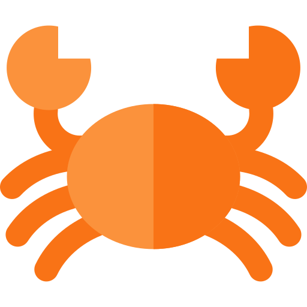

#  Crabigator

Control Claude Code from anywhere. Answer prompts from your phone while Claude runs on your desktop.

[](https://www.npmjs.com/package/crabigator)
[](https://www.rust-lang.org/)
[](LICENSE)

<p align="center">
  
</p>

## What is Crabigator?

Crabigator is a terminal wrapper that runs Claude Code (or Codex CLI) with real-time status widgets and **remote control from your phone**. The assistant runs natively on your machine exactly as intended, while Crabigator streams the session to a web dashboard where you can:

-  **Answer permission requests** — Approve file writes, command execution, and tool use from anywhere
-  **Respond to questions** — When Claude asks for clarification, reply from your phone
-  **Monitor progress** — Watch the live screen, per-turn recaps, git status, and file changes
-  **Track pull requests** — Every PR a session touches, classified and tracked across sessions
-  **Stay in the loop** — Get notified when Claude needs your input

## Installation

### npm (recommended)

```bash
npm install -g crabigator
```

### Cargo (from source)

```bash
git clone https://github.com/samuelclay/crabigator.git
cd crabigator
cargo install --path .
```

### Prerequisites

- **Claude Code** or **Codex CLI** installed and authenticated
- Node.js 18+ (for npm install) or Rust 1.70+ (for cargo install)
- macOS, Linux, or Windows (WSL)

## Quick Start

```bash
# Run with your default platform (Claude Code unless configured otherwise)
crabigator

# Or pick the platform explicitly
crabigator claude
crabigator codex
```

The first time you run Crabigator, it prompts you to pair with your phone:

1. A pairing link appears in your terminal
2. Open [drinkcrabigator.com/dashboard](https://drinkcrabigator.com/dashboard) on your phone
3. Enter the pairing code to connect

Once paired, your sessions automatically stream to the dashboard.

## Features

###  Remote Control

Answer Claude's prompts from your phone when you're away from your desk. Permission requests, questions, and plan approvals all work remotely.

###  Status Widgets

Real-time widgets below the assistant's interface show:

-  **Session stats** — Time elapsed, prompts sent, tool calls, tokens used
-  **Git status** — Modified, added, and deleted files
-  **Semantic diff** — Changes organized by the functions and classes they touch (Rust, TypeScript, Python, Swift, Objective-C)

###  Turn Recaps

After each turn, Crabigator generates a short recap of what the assistant did — visible in the terminal, on the dashboard, and on the PR board. Recaps are generated locally from your transcripts; only the finished recap is sent to the cloud. Enable with `crabigator recap enable` (requires an Anthropic API key).

###  Cross-Session PR Board

`crabigator prs` opens a live board of every pull request your sessions are working on, across all running sessions, grouped by repository. Sessions classify their PRs as primary or secondary, and the board shows progress, review state, and activity.

<p align="center">
  
</p>

Board keys:

- `/` — Search, including a grep of each live session's transcript with matched excerpts inline (Tab toggles surrounding context)
- `e` / `c` — Expand or collapse detail first, then show or hide older recency buckets at the limit
- `+` / `-` — Widen or narrow the window of finished PRs kept on the board
- Toggle between live sessions and the durable cloud record; the full history lives on the [dashboard's PR board](https://drinkcrabigator.com/dashboard)

###  Native Terminal Experience

-  The assistant runs in a PTY exactly as normal
-  Full scrollback history preserved (primary screen buffer, no alternate screen)
-  Native text selection and clipboard
-  All keyboard shortcuts work (Option+Arrow word navigation, etc.)
-  Clickable file links that open in your IDE (`ide` setting in config)

###  Multi-Platform

Supports both [Claude Code](https://claude.ai/code) (Anthropic) and [Codex CLI](https://github.com/openai/codex) (OpenAI).

## How It Works

```
┌─────────────────────────────────────┐
│                                     │
│         Claude Code (PTY)           │  ← Runs exactly as normal
│                                     │
├─────────────────────────────────────┤
│ Recap · Tracked PRs                 │  ← Handoff strip
│ Stats │ Git Status │ File Changes   │  ← Status widgets
└─────────────────────────────────────┘
                │
                ▼
        ┌───────────────┐
        │  Cloud Relay  │  ← Cloudflare Workers at drinkcrabigator.com
        └───────────────┘
                │
                ▼
        ┌───────────────┐
        │  Your Phone   │  ← Answer prompts remotely
        └───────────────┘
```

Crabigator spawns the assistant CLI in a pseudo-terminal and uses ANSI scroll region escape sequences to confine its output to the top portion of your terminal. Status widgets render below using raw escape codes — no intermediate rendering library. Session state streams to Cloudflare Workers over WebSocket for the mobile dashboard, with automatic reconnection.

## Commands

```bash
crabigator                    # Start with your default platform
crabigator claude             # Use Claude Code
crabigator codex              # Use Codex CLI
crabigator resume             # Resume last session (also: r, --resume)
crabigator continue           # Continue last conversation (also: c, --continue)

crabigator prs                # Live cross-session PR board
crabigator prs --once         # Print one frame of the board and exit

crabigator inspect            # List other running instances
crabigator inspect /path      # Filter instances by working directory
crabigator inspect --watch    # Continuous monitoring
crabigator inspect --raw      # Raw JSON output
crabigator inspect --history  # Hook event history for debugging

crabigator recap enable       # Turn on per-turn recaps (prompts for API key)
crabigator recap disable      # Turn off recaps and remove the stored key
crabigator recap status       # Show recap configuration
crabigator key <api-key>      # Save an Anthropic API key for recaps

crabigator pair               # Generate a dashboard pairing code
crabigator install-launcher   # Install the macOS crabigator:// URL handler
crabigator --no-capture       # Run without writing scrollback.log/screen.txt
```

Any unrecognized arguments pass through to the underlying assistant CLI.

## Configuration

Preferences live in `~/.crabigator/config.toml`:

```toml
default_platform = "claude"   # or "codex"
ide = "vscode"                # clickable file links: vscode, cursor, idea, zed, sublime, none
terminal = "ghostty"          # terminal override: terminal, ghostty (auto-detects if unset)
check_for_updates = true      # check GitHub Releases on startup
recap_enabled = true          # per-turn recaps (needs an API key: crabigator key)
recap_model = "claude-haiku-4-5"  # optional model override for recaps

[pr_board]                    # crabigator prs view preferences (saved automatically)
include_ended = false         # open with durable ended sessions included
detail = 1                    # 0 compact, 1 status, 2 titles, 3 recaps
linger_days = 1               # how long finished PRs stay on the board
```

Claude Code hooks are installed to `~/.claude/crabigator/` for tracking session state and statistics. They are versioned and reinstall themselves automatically when Crabigator updates.

## Session Files

Each session creates `/tmp/crabigator-{session_id}/` containing:

-  `scrollback.log` — Session transcript, built from the platform's JSONL log
-  `screen.txt` — Current screen snapshot
-  `inspect.json` — Widget state for external tools (`crabigator inspect` reads these)
-  `hooks.log` — Hook invocation log (Claude Code)

## Architecture

The desktop app is Rust; the cloud backend is a Cloudflare Workers project. The full module map lives in [AGENTS.md](AGENTS.md) — highlights:

| Area | Where | What |
|------|-------|------|
| App loop | [`src/app.rs`](src/app.rs) | Scroll region layout, event polling, PTY passthrough |
| Terminal | [`src/terminal/`](src/terminal.rs) | PTY management, input encoding, ANSI escape sequences |
| Widgets | [`src/ui/`](src/ui.rs) | Status bar, git, changes, stats, handoff strip, pairing banners |
| Diff parsing | [`src/parsers/`](src/parsers.rs) | Semantic diffs per language, scope attribution |
| Platforms | [`src/platforms/`](src/platforms.rs) | Claude Code hooks and transcript parsing; Codex session logs |
| Recaps & PRs | [`src/recap.rs`](src/recap.rs), [`src/pr.rs`](src/pr.rs), [`src/prs_board.rs`](src/prs_board.rs) | Turn recaps, PR tracking and classification, the `prs` board |
| Cloud client | [`src/cloud/`](src/cloud.rs) | Device identity, HMAC auth, event queue, WebSocket streaming |
| Cloud backend | [`workers/crabigator-api/`](workers/crabigator-api/) | Durable Objects, D1, dashboard, landing page |

## Why "Crabigator"?

 It's a quadruple wordplay:

- **Claude** — The AI we're wrapping
- **Navigator** — It navigates and controls your Claude Code sessions
- **Crab** — Rust's mascot is Ferris the crab
- **Alligator** — Named after the late Claude, the beloved albino alligator at the California Academy of Sciences

## Contributing

Contributions welcome! Please feel free to submit a Pull Request.

```bash
# Development
cargo build              # Debug build
cargo test               # Run tests (fixture snapshots: make test-update)
cargo clippy             # Lint

# Cloud development
cd workers/crabigator-api
npm run dev              # Local dev server
```

## License

MIT License - see [LICENSE](LICENSE) for details.

---

<p align="center">
  <a href="https://drinkcrabigator.com">drinkcrabigator.com</a> ·
  <a href="https://github.com/samuelclay/crabigator/issues">Report a Bug</a> ·
  <a href="https://github.com/samuelclay/crabigator/issues">Request a Feature</a>
</p>
